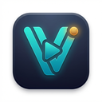

# VideoLM - AI Video Import to NotebookLM

  

  <strong>One-click import YouTube videos, playlists, channels, and search results into Google NotebookLM.</strong> 
  Smart deduplication. Auto-batching. Notion and Obsidian export helpers.

---

## What Is VideoLM?

VideoLM bridges YouTube and Google NotebookLM. It adds a NotebookLM button directly on YouTube pages so you can import the current video, a playlist, a channel, or visible search results without manually copying URLs.

## Key Features

| Feature | Description |
|---|---|
| One-click import | Add the current YouTube video to NotebookLM from the YouTube page |
| Batch import | Import visible videos from channels, playlists, and search results |
| Smart chunking | Split large collections into Part 1, Part 2, etc. for NotebookLM's source limit |
| Smart deduplication | Skip videos already imported into matching notebooks |
| Auto-create notebooks | Create and name NotebookLM notebooks from the YouTube page title |
| Progress notifications | Show Shadow DOM toast progress without interfering with YouTube |
| Notion export | Copy NotebookLM responses into Notion-friendly Markdown |
| Obsidian export | Download NotebookLM responses as Obsidian-friendly Markdown |
| Server entitlement | Free and Pro quota validation for the official extension flow |

## How It Works

1. Install VideoLM from the Chrome Web Store.
2. Open a YouTube video, channel, playlist, or search results page.
3. Click the NotebookLM button added by VideoLM.
4. VideoLM submits the selected YouTube URLs to NotebookLM.
5. Use NotebookLM normally, then optionally export responses to Notion or Obsidian.

## Plans

Free users can import up to the monthly quota shown in the extension. Pro users can unlock higher limits and bundled AI processing where available. License and quota validation is handled by the VideoLM backend for the official extension flow.

Bring-your-own-key AI remains optional. If you enter your own OpenAI or Anthropic API key, it is stored locally in Chrome storage and used directly from your browser.

## Supported Pages

- YouTube video pages (`/watch`)
- YouTube channel pages (`/@handle`)
- YouTube playlist pages (`/playlist`)
- YouTube search results (`/results`)
- NotebookLM notebooks for Notion and Obsidian export buttons

## Privacy

VideoLM does not sell personal data, run ad tracking, or collect analytics. The extension stores import preferences, duplicate cache, source index, optional BYOK API keys, and license settings in Chrome storage.

For license/quota validation and optional bundled Pro AI, the extension may communicate with the VideoLM backend. YouTube and NotebookLM data is used only to provide the import/export features described in the product.

Read the full [Privacy Policy](privacy.html).

## Contact

- Email: studiotest187@gmail.com

---

Built for the NotebookLM research workflow.
